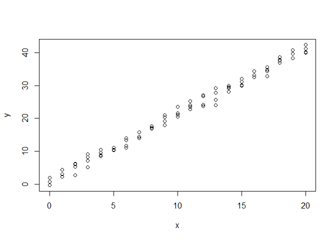

<!-- README.md is generated from README.Rmd. Please edit that file -->

# Metropolis

<!-- badges: start -->
<!-- badges: end -->

We implemented the Metropolis-Hastings algorithm for MCMC sampling. This
README will be used to document the work.

## Example

Wir gehen davon aus das wir ein Experiment machen bei dem wir die
Abhängigkeit von zwei Größen *x* und *y* voneinander verstehen wollen.
Hierzu führen wir eine Reihe von Experimenten durch. Wir gehen davon aus
das wir im Experiment *x* vorgeben können und dann *y* messen können.
Ferner nehmen wir an, dass jede Messung einen normalverteilten Fehler
hat.

Formal können wir dies wie folgt schreiben:

*y* = *f*(*x*) + *ϵ*( \* ).

Wobei

-   *f* den gesuchten funktionalen Zusammenhang zwischen *y* und *x*
    beschreibt
-   *ϵ*( \* ) einen Fehlerterm darstellt. Mit der Schreibweise \*,
    wollen wir an dieser Stelle darauf aufmerksam machen, dass *ϵ* eine
    Funktion ist, deren Wert von im Moment nicht näher spezifizierten
    Größen *ϵ* abhängt. Bspw. kann der Fehler sowohl von *x* abhängen
    und auch vom der einzelnen Messung. Der Einfachheit halber werden
    wir im Folgenden annehmen, das der Fehler *ϵ* rein zufällig ist,
    d.h. keine korreleation zwischen Fehler und den Meßgrößen existiert.
    Dies sollte durch ein gutes Experimentdesign auch sichergestellt/
    vermieden werden.

## A true data generating process

Für unsere Untersuchung nehmen wir an, dass beide Größen folgender
linearer Gleichung genügen: (true data generating process)

*y* = *m* ⋅ *x* + *n*.

Erzeugen wir also diese Werte uns speichern sie in einer Tabelle
(tibble). Hierzu nehmen wir an, dass der Fehler *ϵ* normalverteilt mit
einer festen Standardabweichung *σ* ist:

``` r
# simple linear regression
#
# y ~ mx+n+epsilon
# y ~ N(mx+n, sigma)

# true data generating process
n <- 1
m <- 2
sigma <- 1

# done a series of experiments and repeated it 4 times
x <- rep.int(x = seq(from = 0, to = 20, by = 1),
             times = 4)
y <- sapply(x, function(i){
  rnorm(n = 1,
        mean = m * i + n,
        sd = sigma)
})

df <- dplyr::tibble(x = x,
                    y = y)
```

Betrachten wir das Resultat:

``` r
plot(df)
```



So eine Messung würde das Herz wohl vieler Experimentatoren höher
schlagen, da der lineare Zusammenhang gut zu erkennen ist. Das nächste
Ziel ist also den Anstieg *m* und den Ordinatenabschnitt *n* “sinnvoll”
zu bestimmen.

Mittels einer kleinsten Quadrate Schätzung kann man ein maximum
likelihood estimate für *m* und *n* generieren, d.h. wir erhalten einen
Wert für *m* und *n* der am wahrscheinlichsten nach der gewählten
Methode der kleinsten Quadrate ist.

Allerdings hat die reine Information des Maximums (dem
wahrscheinlichsten Wert) den folgenden Nachteil. Wir wissen nicht wie
wahrscheinlich die anderen Werte sind. Ich denke, das Problem wird im
folgenden Schaubild gut klar:

Das Schaubild zeigt für einen gegebenen Wert von *n* dessen
Warhscheinlichkeit *P*(*n*) unter zwei unterschiedlichen Verteilungen.


In beiden Fällen liegt bei *n* = 1 das Maximum, d.h. die Information die
uns ein reiner Punktschätzer liefern würde.

Haben wir aber zusätzlich die Information des Schaubildes, so würden wir
im Fall von Verteilung 2 vielleicht spontan sagen, dass für *n* keine
Schätzung im gewählten setting möglich ist.

Wir möchten als gerne wissen, wie die Wahrscheinlichkeitsverteilungen
für *n* und *m* aussehen unter der Annahme das *y* und *x* bekannt sind.
In anderen Worten interssieren wir uns für die bedingten
Wahrscheinlichkeiten:

$$
\\begin{align}
P(n\|x,y)\\\\
P(m\|x,y)
\\end{align}
$$

Diese bedingten Wahrscheinlichkeiten werden wir mit dem Satz von Bayes
berechnen können.

## Interlude Bayes rule

Wir erinnern uns an den Satz von Bayes:

$$
P(\\theta\|y) = \\frac{P(y\|\\theta)P(\\theta)}{P(y)}
$$
Hierbei nennen wir die Terme:

-   *P*(*θ*\|*y*) Posteriori (Verteilung)
-   *P*(*y*\|*θ*) likelihood (Verteilung oder data generating function)
-   *P*(*θ*) Prior (Verteilung der Parameter)
-   *P*(*y*) geben wir in diesem Dokument keinen Namen, da der Term im
    Folgenden nicht relevant ist.

Der Satz kann wie folgt interpretiert werden: Trifft man eine Vermutung
über die Verteilung *P*(*θ*) des zu untersuchenden Parameters *θ* und
spezifiziert mit der likelihood *P*(*y**θ*) die Verteilung wie sich die
Daten *y* aus den Parametern ergeben, dann ist die Wahrscheinlichkeit
*P*(*θ*\|*y*), den Parameter *θ* zu beobachten gegeben die Daten *y*,
proportional zum Produkt aus likelihood und prior.

Unser Beispiel schreibt sich somit

*P*(*n*, *m*\|*y*, *x*) ∝ *P*(*y*\|*n*, *m*, *x*)*P*(*n*, *m*\|*x*)

## Metropolis-Hastings

Mit dem Metropolis-Hastings algrotihmus können von einer beliebigen
Wascheinlichkeitsverteilung *P*(*x*) Stichproben gezogen werden, wenn zu
*P*(*x*) proportionale Funktion bekannt ist.

# short story

Consider a linear regression problem

*y* = *m* ⋅ *x* + *n*,
in which we want to approximate the join probatility distribution
*P*(*θ*) = *P*(*m*, *n*).

We make the following assumptions:

1.  *n*, *m* and *x* are statistically independent, i.e.
    -*P*(*θ*\|*x*) = *P*(*θ*) -*P*(*n*, *m*) = *P*(*n*) ⋅ *P*(*m*)

Hence we have

$$
\\begin{align}
P(\\theta\|y,x) &\\propto P(y\|\\theta,x) \\cdot P(\\theta\|x)\\\\
P(m,n\|y,x) &\\propto P(y\|m,n,x) \\cdot P(m) \\cdot P(n)
\\end{align}
$$

## Prior

We set the following prior distributions

*P*(*m*) = *P*(*n*) = Normal(*m**e**a**n*, *s**d*)
Where `mean` and `sd` are parameters we have to set This leads to `R`
code

``` r
prior_prob <- function(n, mean_n = 0., sd_n = 1., log =FALSE){
  # returns normal densitiy of n
  stats::dnorm(n, mean_n, sd_n, log = FALSE)
}
prior_sample <- function(n=1, mean_n = 0, sd_n = 1){
  # returns a sample from the normal 
  stats::rnorm(n, mean = mean_n, sd = sd_n)
}
```

## likelihood

*P*(*y*<sub>*i*</sub>\|*m*, *n*, *x*<sub>*i*</sub>) = Normal(*y*<sub>*i*</sub> − *m* ⋅ *x*<sub>*i*</sub> + *n*, *s**d*)

in `R` code

``` r
likelihood_prob <- function(y,mean_y=0, sd_y=1){
  stats::dnorm(y, mean_y, sd_y)
}

likelihood_sample <- function(n=1, mean_y=0., sd_y=1.){
  stats::rnorm(n, mean = mean_y, sd = sd_y)}
```
