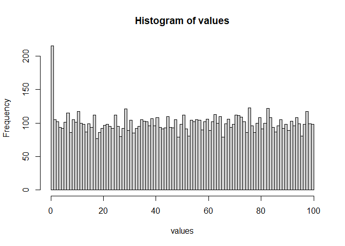

sbc
================
Christian Barz
created 2021-05-27, updated: 2021-06-02

-   [1 to dos](#to-dos)
-   [2 Simmulation based calibration](#simmulation-based-calibration)
-   [3 A basic Implementation](#a-basic-implementation)
    -   [3.1 steuerungsparameter](#steuerungsparameter)
    -   [3.2 random variable to analyse the
        parameter](#random-variable-to-analyse-the-parameter)
    -   [3.3 rank statistic](#rank-statistic)
    -   [3.4 prior (draws)](#prior-draws)
    -   [3.5 likelihood (draws)](#likelihood-draws)
    -   [3.6 posterior (draws from the
        sampler)](#posterior-draws-from-the-sampler)
    -   [3.7 sbc](#sbc)
-   [4 References](#references)

# 1 to dos

-   [ ] include a real sampler
-   [ ] include a “real” model
-   [ ] expand to a vector of random variables (auswertungsfunktionen
    der samples)

# 2 Simmulation based calibration

In this note we give a simple implementation of simmulation based
calibration (sbc). The idea of simmulation based calibration is that
when

# 3 A basic Implementation

## 3.1 steuerungsparameter

``` r
L <- 100 # number of posterior draws
N <- 10000 # 
parameters <- 1 # additional parameters, e.g. predictor matrix or hyperparameters
```

## 3.2 random variable to analyse the parameter

``` r
# one-dimensional random variable (used in rank statistic)
f <- function(x){x}
```

## 3.3 rank statistic

``` r
# rank statistic , according to 4.1 in sbc talts
rank_statistic <- function(f, theta_L, theta){
  lapply(theta_L, function(x){
    f(x) < f(theta)
  }) %>%
    purrr::reduce(sum)
}
```

## 3.4 prior (draws)

draws a sample from the prior. in general it has the form *P*(*θ*\|*x*)
as our prior may dependt on an additional variable, e.g. the predictors
*x*.

This function has to be specified by the user and defines a test

``` r
prior_draw <- function(parameters){
  theta <- rnorm(n=1, # draw one sample from a normal distribution
                 mean = 0, # with mean 0
                 sd = parameters) # and standard deviation 1
  return(theta)
}
```

## 3.5 likelihood (draws)

in general *P*(*y*\|*θ*, *x*) has to be specified by user and defines a
test

``` r
likelihood_draw <- function(theta, parameters){
  y <- rnorm(n = 1,
             mean = theta,
             sd = parameters)
  return(y)
}
```

## 3.6 posterior (draws from the sampler)

we recall bayes theorem

*P*(*θ*\|*y*, *x*) ∝ *P*(*y*\|*θ*, *x*) ⋅ *P*(*θ*\|*x*)

a sampler now uses the right hand side to generate samples for the left
hand side. this sentence motivates the parameter `theta` in the
definition of the following function `sampler_draws`

in practice it will be replaced by the sampler we want to test.

``` r
sampler_draws <- function(L,theta,y,parameters){
    theta_L <- rnorm(n=L, 
                     mean = y, 
                     sd = parameters)
}
```

## 3.7 sbc

sbc consists in at least 2 steps

1.  generate draws from the prior *θ* and *θ*<sub>*L*</sub> and compute
    rank statistics

2.  analyse the output from step 1.

### 3.7.1 generate values

``` r
sbc <- function(prior_draw,
                likelihood_draw, 
                sampler_draws,
                f,
                N = 1000,
                L = 100,
                parameters
                ){
  
  sapply(1:N, function(i_){
    
    theta <- prior_draw(parameters)
    # compute rank statistic
    rank_statistic(f = f, 
                   theta_L = sampler_draws(L = L,
                                           theta = theta,
                                           y = likelihood_draw(theta, 
                                                               parameters), 
                                           parameters = parameters
                                           ), 
                   theta = theta)
  })
}
```

``` r
values <- sbc(
  prior_draw = prior_draw, 
  likelihood_draw = likelihood_draw, 
  sampler_draws = sampler_draws,
  f = f,
  N = N,
  L = L,
  parameters = parameters
  )
```

### 3.7.2 analyse values

``` r
hist(values, breaks = L)
```

<!-- -->

# 4 References
